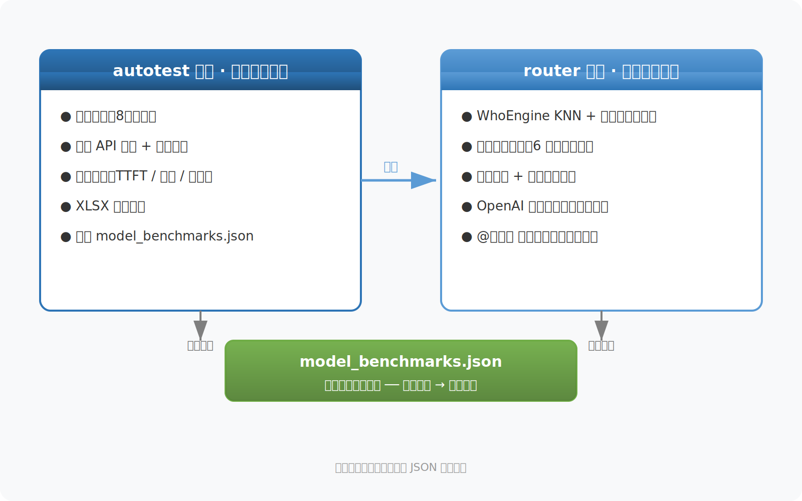

<p align="center">
  <h1 align="center">test_auto_route</h1>
  <p align="center"><strong>Automated LLM Evaluation + Intelligent Routing Program</strong></p>
  <p align="center">
    <a href="./README.md">中文</a> | <a href="./README_EN.md">English</a>
  </p>
  <p align="center">
    <a href="https://www.python.org/downloads/"></a>
    <a href="https://pytorch.org/"></a>
    <a href="https://fastapi.tiangolo.com/"></a>
    <a href="./LICENSE"></a>
  </p>
</p>

---

## Introduction

**test_auto_route** is an automated LLM evaluation and intelligent routing program, solving two core problems:

- **Automated Evaluation**: Objectively and comprehensively evaluate LLM capabilities across diverse benchmark suites
- **Intelligent Routing**: Automatically select the best model based on user input when multiple models are available

These two functions are connected through `model_benchmarks.json`: the evaluation system produces model capability data, and the routing system consumes this data for intelligent model selection.

**Key Features:**
- **KNN + Keyword Prior Routing** — High domain classification accuracy, corrects embedding confusion
- **8 Benchmark Suites** — From multiple-choice and math reasoning to long-context and workplace subjective questions
- **6 Routing Strategies** — Average, Majority Voting, KNN, KNN+Prior, Ensemble, etc.
- **OpenAI-Compatible API** — Standard `/v1/chat/completions`, works with any OpenAI client out of the box
- **`@model-name` Override** — Use `@model-name` at the start of a message to bypass routing and specify a model directly
- **GPU Acceleration** — Auto-detects GPU, embedding inference ~10ms

---

## Table of Contents

- [Quick Start](#quick-start)
- [Workflow](#workflow)
- [Project Structure](#project-structure)
- [Routing Algorithm](#routing-algorithm)
- [Supported Benchmarks](#supported-benchmarks)
- [API Endpoints](#api-endpoints)
- [Configuration Guide](#configuration-guide)
- [FAQ](#faq)
- [License](#license)

---

## Quick Start

### Requirements

- Python 3.10+
- PyTorch 2.0+ (CUDA 11.8+ recommended for GPU acceleration)
- 8GB+ VRAM (optional, for GPU-accelerated embedding inference)

### Installation

```bash
# Clone the repository
git clone https://github.com/your-username/test_auto_route.git
cd test_auto_route

# Create a virtual environment
python -m venv venv

# Activate
# Windows:
venv\Scripts\activate
# Linux/Mac:
source venv/bin/activate

# Install dependencies
pip install -r requirements.txt
```

### Configuration

**Step 1: Configure Evaluation API**

Edit `autotest/config.py`:

```python
TEST_API_KEY = "sk-your-api-key-here"         # API key for the model under test
TEST_BASE_URL = "https://api.example.com/v1/chat/completions"
TEST_MODEL_NAME = "your-model-name"
```

**Step 2: Configure Routing Model Server**

Edit `router/config.py`:

```python
REMOTE_SERVER_CONFIG = {
    "model_routes": {
        "model-a": "https://your-server:8443/v1/chat/completions",
        "model-b": "https://your-server:8443/v1/chat/completions",
    },
}
```

**Step 3: Run Automated Evaluation**

```bash
python run.py test
```

After completion, results are saved in the `results/` directory, and capability data is aggregated into `model_benchmarks.json`.

**Step 4: Start the Routing Service**

```bash
python run.py route
```

The service runs at `http://0.0.0.0:8000` by default.

---

## Workflow



---

## Project Structure

```
test_auto_route/
├── run.py                          # [Entry] Unified entry script
├── requirements.txt                # Python dependencies
├── .gitignore
├── README.md                       # Project README (Chinese)
├── README_EN.md                    # Project README (English)
├── 项目说明文档.md                  # Detailed technical docs (Chinese)
├── model_benchmarks.json           # Model evaluation data (routing basis)
│
├── autotest/                       # ===== Automated Evaluation =====
│   ├── config.py                   # Evaluation config (API keys, paths)
│   ├── main.py                     # Evaluation controller
│   ├── model_api.py                # Model API calls + scoring logic
│   ├── parser.py                   # Benchmark parsers (8 formats)
│   ├── utils.py                    # Result export (XLSX)
│   ├── benchmark_efficiency.py     # Efficiency tests (TTFT/throughput/concurrency)
│   └── benchmarks_json.py          # JSON aggregation
│
├── router/                         # ===== Intelligent Routing =====
│   ├── config.py                   # Routing config
│   ├── app.py                      # FastAPI service entry
│   ├── whoengine.py                # [Core] WhoEngine router
│   ├── router_engine.py            # Routing engine
│   ├── model_client.py             # Remote model client
│   ├── task_classifier.py          # Task classifier (backup)
│   ├── scoring.py                  # Model scoring & selection
│   └── model_profiles.py           # Model capability profiles
│
├── benchmarks/                     # ===== Benchmark Suites =====
│   ├── mmlu_gsm8k_hellaswag/       # Basic benchmarks
│   ├── bbh_longbench/              # Advanced benchmarks
│   ├── training_extra/             # Router training augmentation samples
│   └── workplace/                  # Workplace subjective questions
│
├── results/                        # Test results (auto-generated, gitignored)
└── models/                         # Embedding model cache (auto-generated, gitignored)
```

---

## Routing Algorithm

### Algorithm Evolution

| Algorithm | Accuracy | Characteristics |
|-----------|----------|-----------------|
| Ridge Regression (baseline) | 71.0% | Linear decision boundary |
| Token-level Voting | 67.7% | Per-token classification + voting |
| KNN (k=20) | 83.9% | Non-parametric, fits non-linear boundaries |
| **KNN + Keyword Prior (recommended)** | **High** | **KNN + keyword bias, corrects embedding confusion** |

### Core Principle

**KNN + Keyword Prior Hybrid Routing** is the core innovation of this project:

1. **KNN Soft Voting**: Encode the query into a multi-pooled sentence vector (mean+max+cls), compute cosine similarity with all training samples, take top-k neighbors for softmax soft voting
2. **Keyword Prior Bias**: Maintain a strong-signal keyword table for each domain; generate a prior probability distribution when keywords are detected
3. **Hybrid Decision**: Final probability = α × KNN probability + (1-α) × keyword prior (α=0.5 works best)

> Why keyword priors? Error analysis revealed that the embedding model misclassifies "chemical formula" as a math question (because the training data contains many English math problems). Keyword priors provide strong signals to correct such systematic confusion without breaking the pure ML capability.

For detailed experimental data, see [项目说明文档](./项目说明文档.md).

---

## Supported Benchmarks

| Benchmark | Type | Count | Scoring Method |
|-----------|------|-------|----------------|
| MMLU | Multiple choice | 30 | Answer comparison |
| GSM8K | Math fill-in | 10 | Answer comparison |
| HellaSwag | Multiple choice | 20 | Answer comparison |
| BBH Semantic | Multiple choice | 10 | Answer comparison |
| BBH Math | Math computation | 10 | Answer comparison |
| LongBench | Long-context understanding | 10 | LLM scoring (0-10) |
| Workplace - PM | Subjective | 20 | LLM scoring (0-10) |
| Workplace - Secretary | Subjective | 20 | LLM scoring (0-10) |

---

## API Endpoints

The routing service provides the following HTTP endpoints:

| Endpoint | Method | Description |
|----------|--------|-------------|
| `/v1/chat/completions` | POST | Chat completion (core endpoint, OpenAI-compatible) |
| `/v1/route` | POST | Query routing result only (no remote model call) |
| `/v1/models` | GET | List available models |
| `/v1/models/@mention` | GET | Frontend @mention model list |
| `/health` | GET | Health check |

### Examples

```bash
# Routing analysis (no remote model call)
curl -X POST http://localhost:8000/v1/route \
  -H "Content-Type: application/json" \
  -d '{"prompt":"Solve 3x+5=20 for x"}'

# Chat completion (auto-routing + remote call)
curl -X POST http://localhost:8000/v1/chat/completions \
  -H "Content-Type: application/json" \
  -d '{"messages":[{"role":"user","content":"Solve 3x+5=20 for x"}]}'
```

**Specify a model (bypass routing):** Use `@model-name` at the start of the message
```
@model-name Write a quicksort algorithm
```

---

## Configuration Guide

### Key Configuration Files

| File | Purpose |
|------|---------|
| `autotest/config.py` | API keys, model names, benchmark paths |
| `router/config.py` | Routing strategy, remote model server URLs, WhoEngine config |

### WhoEngine Configuration Example

```python
WHOENGINE_CONFIG = {
    "embedder": "BAAI/bge-large-zh-v1.5",  # Embedding model
    "routing_strategy": "knn_prior",       # Recommended strategy
    "knn_k": 20,                           # KNN neighbors
    "knn_prior_alpha": 0.5,                # Prior mixing coefficient
    "knn_sim_temp": 10.0,                  # Similarity temperature
}
```

---

## FAQ

**Q: What if routing accuracy is low?**
A: Ensure `routing_strategy` is set to `knn_prior`, delete `whoengine.pt`, and restart the service to retrain.

**Q: How do I add a new Domain?**
1. Prepare training question files and place them in `benchmarks/`
2. Add the path in `router/config.py` under `benchmark_files`
3. Add keywords for the new domain in `whoengine.py` under `DOMAIN_KEYWORDS_PRIOR`
4. Delete `whoengine.pt` and restart the service

**Q: Which embedding models are supported?**
A: All sentence-transformers models are supported; `BAAI/bge-large-zh-v1.5` is recommended. The first run automatically caches to `models/sentence_transformers/`, no internet required afterward.

**Q: Is GPU acceleration supported?**
A: Yes, WhoEngine auto-detects GPU; embedding model and KNN computations all run on GPU, with inference latency ~10ms. To install CUDA-enabled PyTorch:
```bash
pip install torch --index-url https://download.pytorch.org/whl/cu121
```

---

## License

[MIT](LICENSE)
