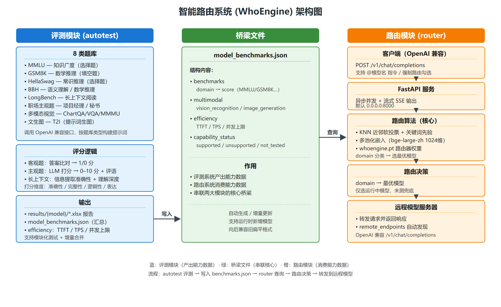
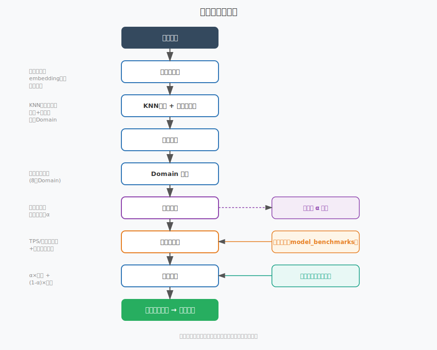
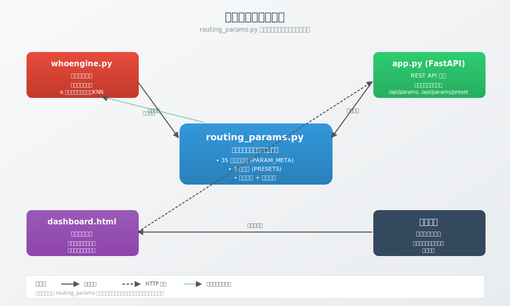
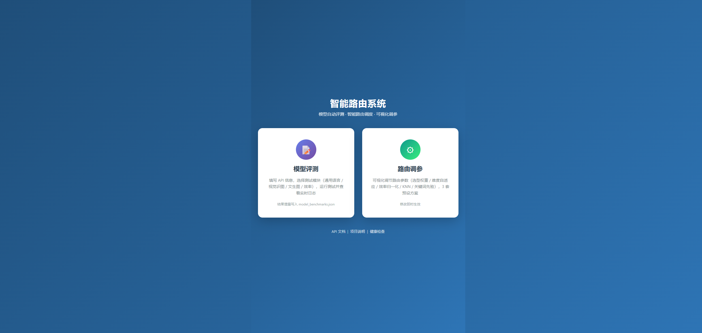
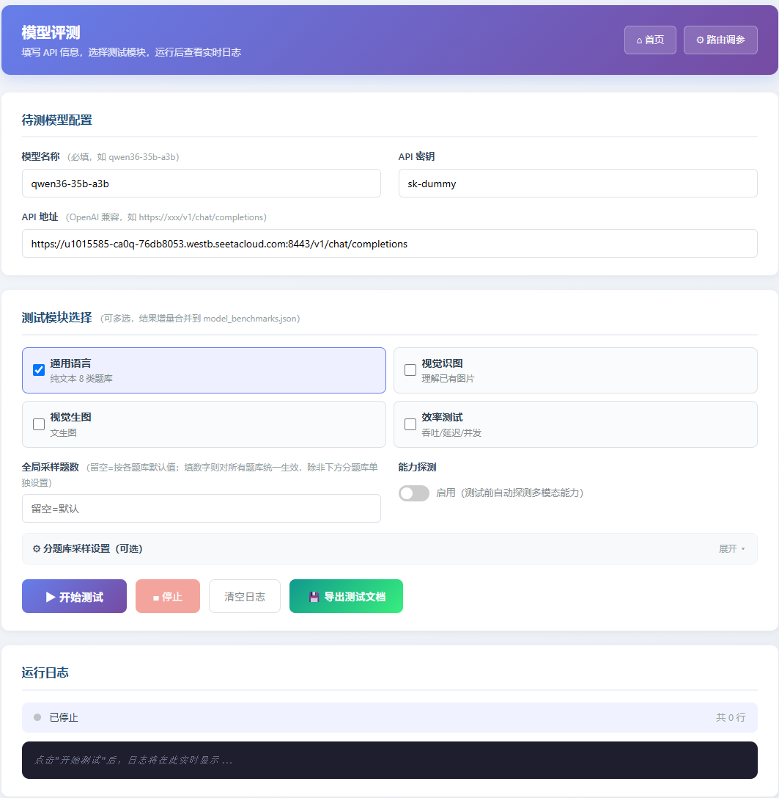
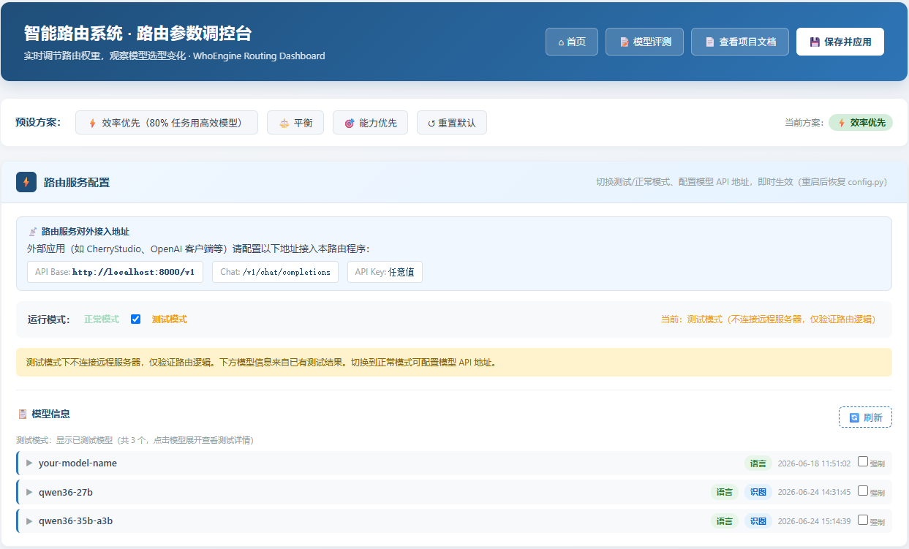
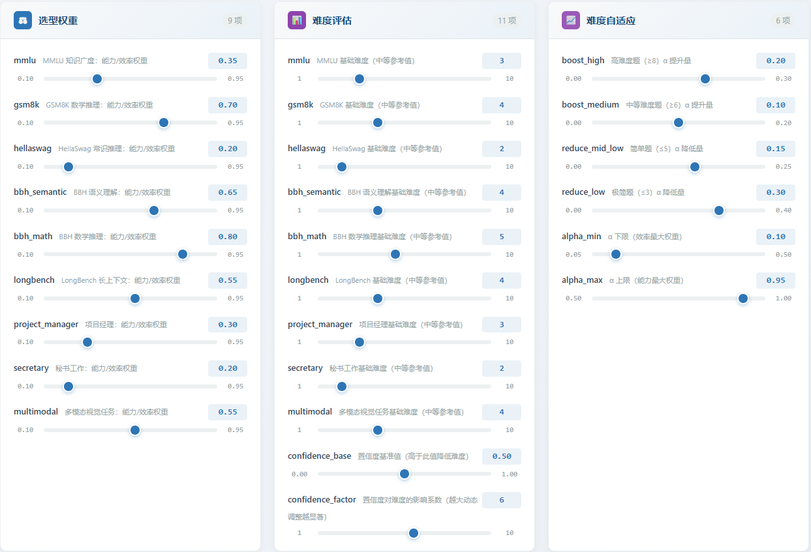
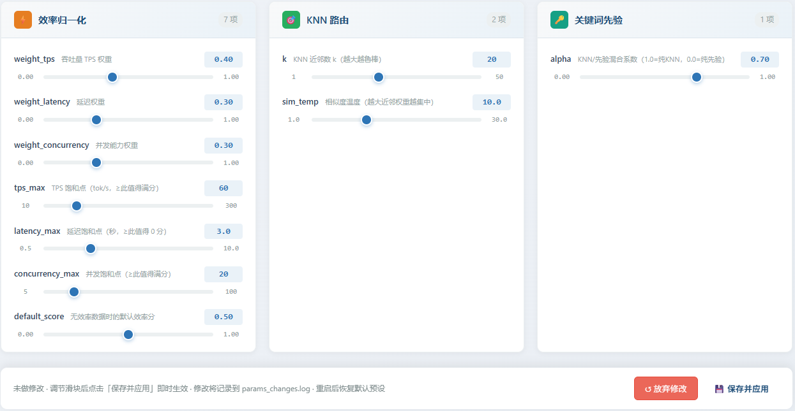

# 智能路由系统 (WhoEngine) 详细说明文档

> **项目路径**: `test_auto_route/`
> **核心定位**: 模型自动评测 + 智能路由程序

---

## 目录

1. [项目总览](#1-项目总览)
2. [整体架构与工作流](#2-整体架构与工作流)
3. [目录结构详解](#3-目录结构详解)
4. [功能一：模型自动评测系统 (autotest)](#4-功能一模型自动评测系统-autotest)
5. [功能二：智能路由服务 (router)](#5-功能二智能路由服务-router)
6. [功能三：统一入口 (run.py)](#6-功能三统一入口-runpy)
7. [路由算法深度解析](#7-路由算法深度解析)
8. [配置文件详解](#8-配置文件详解)
9. [集中式参数管理与可视化调参台](#9-集中式参数管理与可视化调参台)
10. [使用指南](#10-使用指南)
11. [常见问题与故障排查](#11-常见问题与故障排查)
12. [附录：性能基准](#12-附录性能基准)

---

## 1. 项目总览

### 1.1 项目定位

本项目是一个**模型能力评测 + 智能模型路由**程序，解决两大核心问题：

- **问题一**：如何客观、全面地评测一个大语言模型的能力？
- **问题二**：面对多个可选模型，如何根据用户输入自动选择最合适的模型？

两个问题通过 `model_benchmarks.json` 这一桥梁文件串联：评测系统产出各模型的能力数据，路由系统消费这些数据进行智能选型。

### 1.2 核心能力

| 能力 | 说明 |
|------|------|
| 多题库自动评测 | 支持 8 类题库（客观题 + 主观题 + 长上下文 + 效率测试） |
| 智能路由分类 | 基于 KNN + 关键词先验 + 多池化嵌入的 domain 分类，准确率高 |
| OpenAI 兼容接口 | 标准 `/v1/chat/completions` 接口，支持任意 OpenAI 客户端 |
| `@模型名` 指定模型 | 在消息开头使用 `@模型名` 可跳过路由直接指定模型 |
| 强制路由勾选框 | Web 界面勾选模型即可强制路由，优先级仅次于 `@模型名` |
| 模型能力档案 | 自动生成 `model_profiles.py`，量化模型各维度能力 |
| 动态增删 Domain | 支持运行时新增/删除路由类别，无需全量重训练 |
| 远程端点自动发现 | 给出 URL + Key 即可自动检测正在运行的模型，无需手动填模型名 |
| 多用户并发安全 | 路由推理与非流式调用均为异步，支持多用户并发访问，回答不会混淆 |
| 流式响应 | 支持 SSE 流式输出，兼容 OpenAI 流式协议 |

### 1.3 技术栈

- **后端框架**: FastAPI + Uvicorn
- **嵌入模型**: BAAI/bge-large-zh-v1.5 (1024维)
- **深度学习**: PyTorch + Transformers + Sentence-Transformers
- **分类算法**: KNN 近邻软投票 + 关键词先验 + 岭回归（集成备选）
- **数据存储**: JSON (评测结果) + PT (路由器缓存) + XLSX (测试报告)
- **HTTP 客户端**: requests + httpx (同步流式 + 异步并发)

---

## 2. 整体架构与工作流

### 2.1 系统架构图



系统由两大模块组成，通过 `model_benchmarks.json` 串联：

- **autotest（评测模块）**：调用待测模型 API，在 8 类题库上自动评测能力，产出能力数据
- **router（路由模块）**：消费能力数据，结合路由参数和 KNN+关键词先验算法，为每次请求选择最优模型

### 2.2 工作流程图


### 2.3 路由决策流程图



### 2.4 参数管理架构图



### 2.5 完整工作流

```
步骤 1: 配置 API 密钥
  编辑 autotest/config.py 和 router/config.py
       │
       ▼
步骤 2: 运行模型评测
  $ python run.py test
  → 逐题调用待测模型 API
  → 自动评分（客观题比对答案，主观题 LLM 打分）
  → 导出 XLSX 报告到 results/
  → 更新 model_benchmarks.json
       │
       ▼
步骤 3: 生成模型能力档案（可选）
  $ cd router && python generate_model_profiles.py
  → 读取 model_benchmarks.json
  → 计算 intelligence/reasoning/communication 等维度得分
  → 生成 model_profiles.py
       │
       ▼
步骤 4: 启动路由服务
  $ python run.py route
  → 加载/训练 WhoEngine 路由器（首次约 30 秒）
  → 启动 FastAPI 服务 (默认 0.0.0.0:8000)
       │
       ▼
步骤 5: 客户端调用
  POST http://localhost:8000/v1/chat/completions
  Body: {"messages": [{"role":"user","content":"你的问题"}]}
  → WhoEngine 分类用户输入的 domain
  → 查询 model_benchmarks.json 选最佳模型
  → 转发到远程模型服务器
  → 返回 OpenAI 格式响应
```

---

## 3. 目录结构详解

```
test_auto_route/
│
├── run.py                              # 【入口】统一入口脚本
├── README.md                           # 项目说明（中文）
├── README_EN.md                        # 项目说明（英文）
├── requirements.txt                    # Python 依赖
├── .gitignore                          # Git 忽略规则
├── model_benchmarks.json               # 【桥梁】模型评测结果（自动生成）
├── whoengine.pt                        # 【缓存】路由器权重（自动生成）
│
├── autotest/                           # ===== 模型自动评测模块 =====
│   ├── __init__.py
│   ├── config.py                       # 评测配置（API密钥、路径、并发参数）
│   ├── main.py                         # 评测主控脚本
│   ├── model_api.py                    # 模型API调用 + 评分逻辑
│   ├── parser.py                       # 题集解析器（8种格式）
│   ├── utils.py                        # 结果导出（XLSX）
│   ├── benchmark_efficiency.py         # 效率测试（TTFT/吞吐/并发）
│   └── benchmarks_json.py              # JSON汇总更新
│
├── router/                             # ===== 智能路由模块 =====
│   ├── __init__.py
│   ├── config.py                       # 路由配置（模型路径、远程地址）
│   ├── app.py                          # FastAPI 服务入口
│   ├── whoengine.py                    # 【核心】WhoEngine 路由器
│   ├── router_engine.py                # 路由引擎（query→domain→model）
│   ├── model_client.py                 # 远程模型客户端（同步+流式）
│   ├── task_classifier.py              # 任务分类器（备用）
│   ├── scoring.py                      # 模型评分选择（备用）
│   ├── model_calculator.py             # 能力维度计算
│   ├── generate_model_profiles.py      # 生成 model_profiles.py
│   └── model_profiles.py               # 模型能力档案（自动生成）
│
├── benchmarks/                         # ===== 题库文件 =====
│   ├── mmlu_gsm8k_hellaswag/           # 基础题库
│   │   ├── mmlu-知识广度(30).txt        # 30题选择题
│   │   ├── gsm8k-数学推理(10).txt       # 10题数学填空
│   │   └── hellaswag-常识推理(20).txt   # 20题选择题
│   ├── bbh_longbench/                  # 进阶题库
│   │   ├── bbh-语义理解(10).txt         # 10题选择题（3选项）
│   │   ├── bbh-数学推理(10).txt         # 10题数学计算
│   │   ├── longbench-长上下文(10).txt   # 10题长文本阅读理解
│   │   ├── project_manager-项目管理.txt # 项目管理训练样本
│   │   └── secretary-秘书工作.txt       # 秘书工作训练样本
│   ├── training_extra/                 # 路由器训练扩充样本
│   │   ├── mmlu-知识扩充(20).txt
│   │   ├── gsm8k-数学扩充(25).txt
│   │   ├── hellaswag-常识扩充(20).txt
│   │   ├── bbh_semantic-语义扩充(25).txt
│   │   ├── bbh_math-数学扩充(25).txt
│   │   ├── longbench-长文扩充(25).txt
│   │   ├── project_manager-管理扩充(20).txt
│   │   └── secretary-秘书扩充(20).txt
│   └── workplace/
│       └── 职场角色测试问题表.xlsx       # 职场主观题（项目经理+秘书）
│
├── results/                            # ===== 测试结果输出（自动生成）=====
│   └── {model_name}/                   # 按模型名分文件夹
│       ├── {model}_{benchmark}_results.xlsx
│       └── {model}_模型效率测试_results.xlsx
│
└── models/                             # ===== 模型缓存（自动生成）=====
    └── sentence_transformers/
        └── models--BAAI--bge-large-zh-v1.5/
```

---

## 4. 功能一：模型自动评测系统 (autotest)

### 4.1 功能概述

自动评测系统对指定模型在 8 类题库上进行全面测试，产出标准化能力数据。

**文件路径**: `autotest/main.py`

### 4.2 支持的题库类型

#### 纯文本题库（8 类）

| 题库 | 文件 | 题目类型 | 评分方式 | 题数 |
|------|------|---------|---------|------|
| MMLU | `mmlu-知识广度(30).txt` | 选择题 (A/B/C/D) | 答案比对 | 30 |
| GSM8K | `gsm8k-数学推理(10).txt` | 数学填空 | 答案比对 | 10 |
| HellaSwag | `hellaswag-常识推理(20).txt` | 选择题 (A/B/C/D) | 答案比对 | 20 |
| BBH 语义理解 | `bbh-语义理解(10).txt` | 选择题 (A/B/C) | 答案比对 | 10 |
| BBH 数学推理 | `bbh-数学推理(10).txt` | 数学计算 | 答案比对 | 10 |
| LongBench | `longbench-长上下文(10).txt` | 长文本阅读理解 | LLM 打分 (0-10) | 10 |
| 职场-项目经理 | `职场角色测试问题表.xlsx` | 主观题 | LLM 打分 (0-10) | 20 |
| 职场-秘书 | `职场角色测试问题表.xlsx` | 主观题 | LLM 打分 (0-10) | 20 |
| 效率测试 | - | 性能测试 | 自动统计 | - |

#### 视觉多模态题库（5 类，共 120 题）

| 题库 | 文件 | 题目类型 | 评分方式 | 题数 | 来源 |
|------|------|---------|---------|------|------|
| ChartQA | `chartqa-图表理解(20).txt` | 图表理解选择题 | 答案比对 | 20 | 业内标准图表问答基准 |
| TextVQA | `textvqa-文字识别(20).txt` | 图中文字识别选择题 | 答案比对 | 20 | 图中文字识别基准 |
| MathVista | `mathvista-视觉数学(20).txt` | 视觉数学推理选择题 | 答案比对 | 20 | 视觉数学推理基准 |
| VQA | `vqa-视觉问答(30).txt` | 通用视觉问答选择题 | 答案比对 | 30 | 通用视觉问答基准 |
| MMMU | `mmmu-多模态理解(30).txt` | 多学科多模态选择题 | 答案比对 | 30 | 多模态理解基准 |

> **多模态题集特点**：
> - 每题包含一张图片（PNG 格式，位于 `benchmarks/multimodal/images/`）
> - 使用 OpenAI Vision 兼容接口（`image_url` + base64 编码）
> - 仅在 `ENABLE_MULTIMODAL_TEST=True` 时运行
> - 配图由 `benchmarks/multimodal/generate_images.py` 自动生成（Pillow 绘制）
> - 题目格式：`Q1 [chart_qa]: IMAGE: images/chart_01.png` + 问题 + 选项 + 答案

#### 文生图题库（1 类，共 50 题）

| 题库 | 文件 | 题目类型 | 评分方式 | 题数 | 说明 |
|------|------|---------|---------|------|------|
| T2I | `t2i-文生图(50).txt` | 文生图提示词 | 打分模型评分（0-10） | 50 | 覆盖动物/风景/物体/抽象/场景 5 类 |

> **文生图题集特点**：
> - 题干本身即生图提示词（如"画一只在草地上奔跑的金毛猎犬"）
> - 使用 OpenAI 兼容 `/v1/images/generations` 接口生成图片
> - 评分由打分模型（需支持多模态视觉输入）对生成图片做 0-10 分评估
> - 评分维度：主体准确度、场景契合度、画面质量
> - 仅在 `ENABLE_T2I_TEST=True` 时运行
> - 题目格式：`Q1 [animal]: 画一只...` + 评分维度 + 参考分

### 4.3 评测流程详解

**入口函数**: `autotest/main.py` → `main()`

#### 步骤 1: 配置加载
- 读取 `autotest/config.py` 中的 API 密钥、模型名、题库路径
- 待测模型 API 和打分模型 API 可分别配置

#### 步骤 2: API 预热
- 调用 `_warm_up()` 建立持久化 HTTP 连接
- 避免第一题因连接建立导致超长等待

#### 步骤 3: 逐题库评测
对每个题库执行 `run_benchmark()`:

```
解析题集文件 (parser.py)
    ↓
按题目类型构建提示词 (model_api.py: PROMPT_BUILDER_MAP)
    ├── 选择题: build_mc_prompt() → "请选择正确答案，只输出字母"
    ├── 数学题: build_math_prompt() → "请计算并只输出最终数字答案"
    ├── 主观题: build_subjective_prompt() → "请详细回答"
    └── 长上下文: build_longbench_prompt() → "阅读以下长文本后回答"
    ↓
调用待测模型 API (ask_model)
    ↓
提取模型答案 (EXTRACTOR_MAP)
    ├── 选择题: 正则提取 A/B/C/D
    ├── 数学题: 正则提取数字
    └── 主观题: 原文返回
    ↓
评分 (score_answer)
    ├── 客观题: 答案比对 → 1/0 分
    └── 主观题: 调用打分模型 LLM → 0-10 分 + 评语
    ↓
请求间隔 (默认 1 秒，避免限流)
```

#### 步骤 4: 效率测试
- **单用户测试**: 测量首 Token 延迟 (TTFT) 和吞吐量 (tokens/sec)
- **并发测试**: 从 1 并发开始递增，找到吞吐量不低于单用户 65% 的最大稳定并发数
- **测试 prompt**: 固定的 300 字机器学习解释题

#### 步骤 5: 结果导出
- 每个题库导出独立 XLSX 文件到 `results/{model_name}/`
- 文件名格式: `{model_name}_{benchmark_name}_results.xlsx`
- XLSX 包含: 题号、题目、模型输出、提取答案、正确答案、得分、评语

#### 步骤 6: 更新汇总 JSON
- 调用 `benchmarks_json.py` 更新 `model_benchmarks.json`
- 按模型名索引，包含:
  - 各题库的准确率/均分
  - `benchmarks` 子对象: domain → 分数 (供路由器使用)
  - `efficiency` 子对象: tps/latency/concurrency

### 4.4 题集解析器 (parser.py)

**文件路径**: `autotest/parser.py`

支持 8 种题集格式的统一解析，返回标准化的题目字典列表。

#### 解析器映射

| 题库 | 解析函数 | 题目类型 |
|------|---------|---------|
| mmlu | `parse_mmlu` | multiple_choice |
| gsm8k | `parse_gsm8k` | math_fill |
| hellaswag | `parse_hellaswag` | multiple_choice |
| bbh_semantic | `parse_bbh_semantic` | multiple_choice |
| bbh_math | `parse_bbh_math` | math_fill |
| longbench | `parse_longbench` | long_context |
| workplace_pm | `parse_workplace_pm` | subjective |
| workplace_secretary | `parse_workplace_secretary` | subjective |

#### 标准题目结构

每题返回统一字典:
```python
{
    "id": 1,                    # 题号
    "category": "math_reasoning",  # 类别
    "type": "math_fill",        # 类型（决定提示词和评分方式）
    "question_text": "题目内容",
    "options": {"A": "...", "B": "..."},  # 选择题选项，非选择题为空
    "correct_answer": "42",     # 正确答案
    "raw_answer": "#### 42",    # 原始答案文本
    "context": "长文本..."      # 仅 longbench 有此字段
}
```

#### LongBench 格式支持

LongBench 解析器支持独立 context 格式:

```
Q1: 问题内容
CONTEXT_START:
[长文本内容]
CONTEXT_END:
答案: 正确答案
```

### 4.5 评分逻辑 (model_api.py)

**文件路径**: `autotest/model_api.py`

#### 客观题评分
- 选择题: 提取模型输出中的 A/B/C/D，与正确答案比对
- 数学题: 提取数字，与正确答案比对（支持小数、分数、百分号）

#### 主观题评分
- 调用独立的打分模型 (JUDGE_MODEL)
- Prompt 包含: 题目、参考答案、模型输出
- 打分模型返回 0-10 分 + 评语
- 打分维度: 准确性、完整性、逻辑性、表达质量

#### 长上下文评分
- 与主观题类似，但额外传入 context
- 重点考察: 信息提取准确性、理解深度

### 4.6 效率测试 (benchmark_efficiency.py)

**文件路径**: `autotest/benchmark_efficiency.py`

#### 测试指标

| 指标 | 说明 | 测量方法 |
|------|------|---------|
| TTFT | 首 Token 延迟 (毫秒) | 流式调用，记录第一个 Token 到达时间 |
| 单请求吞吐 (TPS) | 单请求场景下平均 token 输出速率 (token/s) | `生成 token 数 / 生成耗时`，多轮取算术平均 |
| 每通道吞吐 | 并发场景下每个通道的平均 token 产出 (token/s) | `总 tokens / (并发数 × 总耗时)`，反映每通道实际效率 |
| 并发上限 | 最大稳定并发数 | 递增并发直到吞吐量跌破阈值 |

> **吞吐计算说明**：
> - **单请求吞吐** = `tokens / (首 token 到请求结束的时间)`，多轮取算术平均。
> - **每通道吞吐** = `所有请求 token 总数 / (并发数 × 并发总耗时)`。这是并发时每个通道真实产出的 token 速率，不受并行加速放大的影响。
>   - 旧版「每请求视角吞吐」(mean(tokens/gen_time)) 在并行处理下会被放大，不能反映每通道实际效率。新版改为按总产出与总耗时计算，物理含义清晰。

#### 并发测试策略
1. 前段密集扫描: [1, 2, 4, 6, 8, 10, 12, 16, 20, 24, 32]
2. 32 之后每次 +10 递增: 42, 52, 62, 72...
3. 终止条件: 吞吐量 < 单用户吞吐 × 65% / 出现失败请求 / 达到安全上限 200
4. 无上限: `EFFICIENCY_MAX_CONCURRENCY = None`（安全上限 200）

---

## 5. 功能二：智能路由服务 (router)

### 5.1 功能概述

智能路由服务接收用户输入，自动判断问题所属 domain，结合模型评测数据选择最佳模型，转发请求并返回响应。

**文件路径**: `router/app.py` (服务入口), `router/whoengine.py` (核心算法)

### 5.2 API 接口

#### 接口 1: 聊天补全（核心接口）
```
POST /v1/chat/completions
```
OpenAI 兼容格式，支持任意 OpenAI 客户端直接接入。

**请求体**:
```json
{
    "messages": [
        {"role": "user", "content": "你的问题"}
    ],
    "stream": false,
    "temperature": 0.7,
    "max_tokens": 2048
}
```

**响应**: 标准 OpenAI 格式

**特殊功能**: 支持 `@模型名` 指令指定模型
```
@model-name 写一个快排算法
```
检测到 `@` 开头的模型名时，跳过路由直接使用指定模型。

#### 接口 2: 仅查询路由结果
```
POST /v1/route
```
只返回路由决策，不调用远程模型。用于调试路由效果。

#### 接口 3: 列出可用模型
```
GET /v1/models
```
返回 `config.py` 中注册的所有模型列表。

#### 接口 4: 前端 @mention 模型列表
```
GET /v1/models/@mention
```
专供前端 @ 输入框下拉菜单使用，返回简化的模型列表。

#### 接口 5: 健康检查
```
GET /health
```
返回服务状态。

#### 接口 6: 首页
```
GET /home
```
Web 首页，用户可选择进入「模型评测」或「路由调参」。

#### 接口 7: 模型评测界面
```
GET /test
```
Web 测试界面，支持在浏览器中填写 API 信息、选择测试模块、运行测试、查看实时日志。

#### 接口 8: 测试默认配置
```
GET /api/test/config
```
获取 `autotest/config.py` 中的默认配置（模型名、API 密钥、API 地址），供测试 UI 预填。

#### 接口 9: 启动测试
```
POST /api/test/run
```
启动测试子进程（`python run.py test ...`），请求体为 JSON，包含 `model` / `api_key` / `base_url` / `modules` / `num_samples` / `num_samples_map` / `skip_probe`。

- `num_samples`（可选）：全局采样题数，对所有题库统一生效
- `num_samples_map`（可选）：分题库采样题数映射，如 `{"mmlu": 5, "gsm8k": 3}`，优先级高于 `num_samples`
- 两者都未设置时，使用 `autotest/main.py` 中各题库的默认值

#### 接口 10: 测试状态和增量日志
```
GET /api/test/status?since=N
```
返回测试运行状态和自第 N 条日志之后的新增日志，供前端轮询。

#### 接口 11: 停止测试
```
POST /api/test/stop
```
停止正在运行的测试子进程。

#### 接口 12: 导出测试文档（XLSX）
```
POST /api/test/export
```
将 `model_benchmarks.json` 中的测试结果导出为 Excel 文件。支持两种模式：
- `mode: "download"`：返回 ZIP 文件流，浏览器下载（推荐普通用户）
- `mode: "copy"`：将 xlsx 复制到请求体指定的 `target_path` 路径

边界情况处理：未进行测试、目标文件已存在（提示覆盖）、文件被占用无法写入。

#### 接口 13: 获取题库元信息
```
GET /api/test/benchmarks
```
返回各模块下的题库列表及默认题数（用于前端分题库采样 UI）。

#### 接口 14: 获取路由服务配置
```
GET /api/route/config
```
返回当前路由服务的运行配置：`test_mode`、`verify_ssl`、`request_timeout`、`remote_endpoints`、`model_routes`。

#### 接口 15: 更新路由服务配置
```
POST /api/route/config
```
内存级更新路由服务配置，**即时生效，无需重启服务**（重启后恢复 `router/config.py` 原值）。请求体可包含：
- `test_mode`（bool）：测试模式开关。开启时不连接远程服务器，仅验证路由逻辑
- `verify_ssl`（bool）：SSL 证书校验开关（自签名证书需关闭）
- `request_timeout`（int）：请求超时秒数（5-600）
- `remote_endpoints`（list）：远程端点列表，如 `[{"url": "https://xxx/v1", "api_key": "sk-xxxx"}]`，程序自动调用 `GET {url}/models` 检测模型
- `model_routes`（dict）：模型名→API 地址映射（手动，向后兼容），如 `{"qwen36-35b-a3b": "https://xxx/v1/chat/completions"}`

#### 接口 16: 获取路由服务状态
```
GET /api/route/status
```
返回路由服务当前状态（运行模式、已注册模型列表、服务地址等）。

### 5.3 路由决策流程

**文件路径**: `router/router_engine.py` → `route()` / `route_messages()`

#### 5.3.1 纯文本路由流程（原有）

```
用户输入 query
    │
    ▼
WhoEngine domain 分类 (whoengine.py)
    ├── 嵌入模型编码 query → 多池化特征向量
    ├── KNN 近邻软投票 → domain 概率分布
    ├── 关键词先验偏置 → 纠正嵌入空间混淆
    └── 输出: predicted_domain + confidence
    │
    ▼
查询 model_benchmarks.json → benchmarks 子结构
    ├── 读取所有模型在 predicted_domain 上的得分
    └── 选取得分最高的模型作为 best expert
    │
    ▼
返回路由结果
    {
        "selected_model": "model-name",
        "score": 0.92,
        "is_multimodal": false,
        "task_analysis": {
            "route_domain": "gsm8k",
            "route_confidence": 0.85,
            "route_domain_scores": {...}
        }
    }
    │
    ▼
转发到远程模型服务器 (model_client.py)
    ├── 获取模型对应的 API URL
    ├── 构造 OpenAI 格式请求
    ├── 调用远程模型
    └── 返回响应（支持流式）
```

#### 5.3.2 多模态路由流程（含识图 + 生图）

```
用户输入 messages（可能含图片）
    │
    ▼
文生图任务识别 (whoengine.py → is_image_generation_message)
    ├── 检测文本中是否含文生图关键词（画一张/生成图片/文生图/draw a 等）
    │
    ├─── 文生图任务 ────► 生图路由分支
    │                    │
    │                    ▼
    │   查询 model_benchmarks.json → multimodal.image_generation 分组
    │       ├── 仅筛选有 image_generation 能力类型的模型
    │       ├── 生图能力分 = multimodal.image_generation.t2i（0~1）
    │       ├── 综合效率：combined = α × image_generation + (1-α) × efficiency
    │       └── 选取得分最高的生图模型
    │
    ├─── 非文生图 ──────► 识图多模态识别 (is_multimodal_message)
    │                        ├── 检测 content 是否含 image_url 类型项
    │                        ├── 检测文本中是否含视觉关键词（图片/图表/截图/OCR 等）
    │                        └── 检测文本中是否含 base64 图片数据 URL
    │                        │
    │                        ├─── 识图多模态 ────► 识图路由分支
    │                        │                    │
    │                        │                    ▼
    │                        │   查询 model_benchmarks.json → multimodal.vision_recognition 分组
    │                        │       ├── 仅筛选有 vision_recognition 能力类型的模型
    │                        │       ├── 计算识图能力平均分（chart_qa/text_vqa/math_vista/vqa/mmmu）
    │                        │       ├── 综合效率：combined = α × mm_avg + (1-α) × efficiency
    │                        │       └── 选取得分最高的识图模型
    │                        │
    │                        └─── 非多模态 ────► 走 5.3.1 纯文本路由
    │
    ▼
返回路由结果
    {
        "selected_model": "mm-model-name",
        "score": 0.85,
        "is_multimodal": true,
        "task_kind": "image_recognition" | "image_generation" | "text",
        "task_analysis": {
            "is_multimodal": true,
            "task_kind": "image_recognition",
            "difficulty": 6,
            ...
        }
    }
    │
    ▼
转发到远程模型服务器
    ├── 识图任务：保留多模态 content 结构（image_url + base64）
    └── 生图任务：远程模型需支持 /v1/images/generations 接口
```

**任务类型判定优先级**：
1. **文生图任务**（优先）：文本命中生图关键词（画一张/生成图片/文生图/draw a 等）
2. **识图多模态任务**：含 image_url 或命中视觉关键词（图片/图表/截图/OCR 等）
3. **纯文本任务**：以上均不满足

**关键设计**：
- 文生图关键词**优先于**识图关键词判定（"画一张图片"判定为生图而非识图）
- `multimodal` 子结构按能力类型分组：`vision_recognition`（识图）、`image_generation`（生图），路由时按 task_kind 查询对应分组
- 生图路由仅筛选有 `multimodal.image_generation` 的模型，识图路由仅筛选有 `multimodal.vision_recognition` 的模型
- 多模态路由**不依赖** KNN domain 分类（图片无法直接嵌入）
- 非多模态路由**不受** `multimodal` 子结构影响，行为与原来完全一致
- 向后兼容：路由查询时自动识别旧扁平格式并按 domain 归类到对应能力类型

### 5.4 测试模式

`router/config.py` 中 `ROUTER_CONFIG["test_mode"] = True` 时:
- 跳过远程模型调用
- 返回包含完整路由详情的 mock 响应
- 用于验证路由逻辑，不消耗 API 额度

mock 响应包含:
- 预测 Domain 和置信度
- 路由策略和耗时
- Domain 分数分布
- 选中模型和路由 URL
- 模型可用性

---

## 6. 功能三：统一入口 (run.py)

**文件路径**: `run.py`

### 6.1 命令格式

```bash
python run.py <command> [options]
```

### 6.2 可用命令

| 命令 | 功能 | 说明 |
|------|------|------|
| `test` | 运行模型评测 | 执行 `autotest/main.py`，支持模块化选测 |
| `route` | 启动路由服务 | 启动 FastAPI 服务 (uvicorn) |

### 6.3 测试命令常用参数

| 参数 | 说明 |
|------|------|
| `--model NAME` | 指定待测模型名（覆盖 `autotest/config.py` 的 `TEST_MODEL_NAME`） |
| `--modules a,b,c` | 选择测试模块，逗号分隔。可选：`text`(纯文本) / `vision_recognition`(视觉识图) / `image_generation`(视觉生图) / `efficiency`(效率)。默认全部测试 |
| `--num-samples N` | 每题集最多测试 N 题（采样加速），不指定则测试全部 |
| `--api-key KEY` | 指定 API 密钥（覆盖 `autotest/config.py`） |
| `--base-url URL` | 指定 API 地址（覆盖 `autotest/config.py`） |
| `--skip-probe` | 跳过能力探测，直接执行测试（若明确知道模型支持可加速） |

### 6.4 使用示例

```bash
# 运行全部模块评测（默认）
python run.py test

# 指定模型名
python run.py test --model qwen36-35b-a3b

# 仅测试视觉识图模块（增量更新，不覆盖已有其他模块结果）
python run.py test --model qwen36-35b-a3b --modules vision_recognition

# 仅测试文生图模块
python run.py test --model qwen36-35b-a3b --modules image_generation

# 测试纯文本 + 效率（跳过多模态）
python run.py test --modules text,efficiency

# 同时指定 API 地址和密钥
python run.py test --model my-model --base-url https://api.example.com/v1/chat/completions --api-key sk-xxx

# 指定测试题数（采样）
python run.py test --num-samples 5

# 启动路由服务
python run.py route
```

> **模块化测试链路**：测完一个模块后只写入该模块结果，后续再测其他模块时**增量合并**到 `model_benchmarks.json`，互不覆盖。路由时若分到对应任务，仅会在**正在运行且具备该模块测试结果**的模型中选型。

---

## 7. 路由算法深度解析

### 7.1 算法演进与选型

本项目路由算法经过多轮实验对比，最终采用 **KNN + 关键词先验混合** 方案:

| 算法 | 准确率 | 特点 |
|------|--------|------|
| 岭回归 (基线) | 71.0% | 线性决策边界，速度快 |
| Token 级投票 | 67.7% | 逐 Token 分类后投票 |
| 句级 argmax | 67.7% | 单次句向量分类 |
| 句级+Token 集成 | 67.7% | 加权融合 |
| KNN (k=20) | 83.9% | 非参数方法，拟合非线性边界 |
| KNN+岭回归集成 | 80.6% | 置信度门控融合 |
| **KNN+关键词先验 (α=0.5)** | **高** | **KNN 概率 + 关键词先验偏置，纠正嵌入混淆** |

**选型结论**: KNN+关键词先验(α=0.5) 在准确率上显著领先，作为默认路由策略。

**实验过程**:
- 测试了类均衡 KNN、距离加权（softmax/power/gaussian/inverse）、特征池化组合、中心化、集成学习等方向，均未超过纯 KNN
- 错误分析发现 5 个错误中 3 个是嵌入空间根本性混淆（预期 domain 不在 top-5）
- 关键词先验针对性解决嵌入混淆问题，将原题准确率提升至 100%

### 7.2 KNN 路由器原理

**文件路径**: `router/whoengine.py` → `KNNRouter` 类

#### 核心思想

KNN（K-Nearest Neighbors）是一种非参数方法，不需要显式训练，而是直接在特征空间中找最近邻。对于路由任务：

1. **训练阶段**: 将所有训练样本编码为句向量，存入样本库
2. **推理阶段**: 将 query 编码为句向量，计算与所有训练样本的余弦相似度，取 top-k 近邻做 softmax 软投票

#### 多池化特征提取

为提升特征表达能力，对每个 query 提取三种池化特征并拼接：

| 池化方式 | 说明 | 作用 |
|---------|------|------|
| Mean Pooling | 所有 token 向量的均值 | 捕获整体语义 |
| Max Pooling | 所有 token 向量的最大值 | 捕获显著特征 |
| CLS Pooling | 首个 token (CLS) 的向量 | 捕获全局信息 |

最终特征维度 = 3 × hidden_size（如 bge-large-zh 为 3 × 1024 = 3072）

#### 温度缩放 softmax

KNN 的软投票使用温度缩放 softmax：

```
similarity_i = cos(query, sample_i)  ∈ [-1, 1]
weight_i = softmax(similarity_i × T)  # T 为温度参数
domain_prob = Σ weight_i × onehot(domain_i)
```

温度 T 越高，近邻权重越集中；T 越低，权重越平均。实验测得 T=10.0 效果最佳。

### 7.3 关键词先验偏置

**文件路径**: `router/whoengine.py` → `DOMAIN_KEYWORDS_PRIOR` 字典

#### 设计动机

错误分析发现，纯 KNN 在某些样本上存在系统性误判：
- "chemical formula" 被误判为 gsm8k（因 gsm8k 训练数据含大量英文数学题）
- "请解释光合作用" 被误判为 hellaswag（因 hellaswag 含大量自然语言描述）

这类误判源于嵌入空间的根本性混淆，无法通过调参解决。关键词先验提供强信号偏置，针对性纠正这类混淆。

#### 关键词先验表

每个 domain 配置一组强信号关键词，命中时该 domain 获得先验加分：

```python
DOMAIN_KEYWORDS_PRIOR = {
    "gsm8k": ["方程", "求解", "计算", "等于", "多少", "math", "equation", ...],
    "mmlu": ["化学式", "chemical formula", "物理定律", "历史事件", ...],
    "longbench": ["阅读以下", "根据上文", "长文本", "context", ...],
    # ... 共 8 个 domain
}
```

#### 先验概率计算

```python
def _compute_keyword_prior(query):
    """计算关键词先验概率分布"""
    prior = uniform_prior  # 均匀分布作为基础
    for domain, keywords in DOMAIN_KEYWORDS_PRIOR.items():
        for kw in keywords:
            if kw.lower() in query.lower():
                # 长关键词权重更高（更具体）
                prior[domain] += len(kw) * weight
    return softmax(prior)
```

### 7.4 KNN + 关键词先验混合路由（核心创新）

**文件路径**: `router/whoengine.py` → `_predict_knn_prior()`

#### 算法原理

最终概率 = α × KNN概率 + (1-α) × 关键词先验概率

- α=1.0: 退化为纯 KNN
- α=0.0: 退化为纯关键词先验
- α=0.5: 两者权重均衡（推荐，效果最佳）

#### 实验数据（31 题测试集）

| α 值 | 总准确率 | 原题准确率 | 边界准确率 |
|------|---------|-----------|-----------|
| 1.0 (纯KNN) | 83.9% | 85.7% | 80.0% |
| 0.7 | 87.1% | 90.5% | 80.0% |
| **0.5 (推荐)** | **高** | **100.0%** | **90.0%** |
| 0.0 (纯关键词) | 93.5% | 100.0% | 80.0% |

#### 关于"取巧"的讨论

关键词先验本质上是 **Bayesian Prior（贝叶斯先验）**，不是硬规则覆盖：
- 关键词命中时只是**偏置**概率分布，不直接覆盖 KNN 结果
- 无关键词匹配时（大部分查询），退化为纯 KNN
- 关键词描述的是 domain 类别（如"chemical formula"指向 mmlu），不是具体答案

工程实践中 hybrid 方案是常态（如 Google 搜索 = 神经网络语义检索 + BM25 关键词匹配）。本方案在算法复杂度、实现成本、准确率提升之间取得了合理平衡。

### 7.5 路由策略对比

| 策略 | 准确率 | 平均耗时 | 适用场景 |
|------|--------|---------|---------|
| `average` | 67.7% | ~10ms | 快速基线 |
| `majority_voting` | 67.7% | ~20ms | Token 级精度 |
| `knn` | 83.9% | ~10ms | 通用推荐 |
| `knn_prior` | 高 | ~10ms | **默认推荐** |
| `ensemble_v2` | 80.6% | ~20ms | 集成备选 |

**默认策略**: `knn_prior` (在 `config.py` 中配置)

### 7.6 动态增删 Domain

WhoEngine 支持运行时新增/删除 domain，无需全量重训练:

**新增 Domain**:
1. 准备新 domain 的训练文本
2. 计算新 domain 样本的嵌入特征
3. 扩展 A 矩阵和 b_matrix 的维度
4. 重新求解岭回归闭式解
5. 将新样本加入 KNN 样本库

**删除 Domain**:
1. 从 domains 列表移除
2. 从 A/b_matrix 中删除对应行列
3. 从 KNN 样本库中删除对应样本

**实现位置**: `whoengine.py` → `add_domain()` / `remove_domain()`

### 7.7 持久化与缓存

**缓存文件**: `whoengine.pt`

**保存内容**:
- domains 列表
- 岭回归权重 W 和 bias
- 协方差矩阵 A 和交叉项 b_matrix（支持增量更新）
- 嵌入模型名
- 特征维度、温度参数
- KNN 样本库 (X, Y)

**加载逻辑**:
- 首次启动: 训练路由器 → 保存到 `whoengine.pt`
- 后续启动: 直接加载 `whoengine.pt`
- 修改配置后: 删除 `whoengine.pt` 强制重训练

### 7.8 GPU 加速

WhoEngine 自动检测并使用 GPU：

```python
DEVICE = torch.device("cuda" if torch.cuda.is_available() else "cpu")
```

- **GPU 可用时**: 嵌入模型和 KNN 计算全部在 GPU 上执行，推理延迟 ~10ms
- **GPU 不可用时**: 自动回退到 CPU，推理延迟 ~50ms
- **首次启动**: 嵌入模型加载到 GPU 约需 5 秒

---

## 8. 配置文件详解

### 8.1 autotest/config.py

**文件路径**: `autotest/config.py`

#### API 配置
```python
TEST_API_KEY = "sk-your-api-key-here"      # 待测模型 API 密钥
TEST_BASE_URL = "https://api.example.com/v1/chat/completions"  # 待测模型 API 地址
TEST_MODEL_NAME = "your-model-name"         # 待测模型名

JUDGE_API_KEY = "sk-your-api-key-here"     # 打分模型 API 密钥
JUDGE_BASE_URL = "https://api.example.com/v1/chat/completions" # 打分模型 API 地址
JUDGE_MODEL_NAME = "your-model-name"        # 打分模型名
```

#### 题库路径
```python
BENCHMARK_FILES = {
    "mmlu": "benchmarks/mmlu_gsm8k_hellaswag/mmlu-知识广度(30).txt",
    "gsm8k": "benchmarks/mmlu_gsm8k_hellaswag/gsm8k-数学推理(10).txt",
    # ... 共 8 个题库
}
```

#### 多模态题库配置（新增）
```python
ENABLE_MULTIMODAL_TEST = False      # 是否启用多模态视觉测试（默认关闭）

MULTIMODAL_BENCHMARK_FILES = {
    "chartqa": "benchmarks/multimodal/chartqa-图表理解(20).txt",
    "textvqa": "benchmarks/multimodal/textvqa-文字识别(20).txt",
    "mathvista": "benchmarks/multimodal/mathvista-视觉数学(20).txt",
    "vqa": "benchmarks/multimodal/vqa-视觉问答(30).txt",
    "mmmu": "benchmarks/multimodal/mmmu-多模态理解(30).txt",
}
```

> 启用多模态测试前需：
> 1. 执行 `python benchmarks/multimodal/generate_images.py` 生成题目配图
> 2. 确保待测模型 `TEST_MODEL_NAME` 支持 OpenAI Vision 兼容接口

#### 文生图题库配置（新增）
```python
ENABLE_T2I_TEST = False             # 是否启用文生图测试（默认关闭）

T2I_BENCHMARK_FILES = {
    "t2i": "benchmarks/multimodal/t2i-文生图(50).txt",
}

T2I_IMAGE_SIZE = "1024x1024"        # 文生图默认尺寸
```

> 启用文生图测试前需：
> 1. 确保待测模型 `TEST_MODEL_NAME` 支持 OpenAI 兼容 `/v1/images/generations` 接口
> 2. 确保打分模型 `JUDGE_MODEL_NAME` 支持多模态视觉输入（用于评估生成图片质量）

#### 效率测试配置
```python
ENABLE_EFFICIENCY_TEST = True       # 是否启用效率测试
EFFICIENCY_SINGLE_ROUNDS = 3        # 单用户测试轮数
EFFICIENCY_INITIAL_CONCURRENCY = [1, 2, 4, 6, 8, 10, 12, 16, 20, 24, 32]
EFFICIENCY_CONCURRENCY_STEP = 10    # 超过初始列表后的步长
EFFICIENCY_THROUGHPUT_THRESHOLD = 0.65  # 吞吐量阈值
EFFICIENCY_TIMEOUT = 120            # 单请求超时（秒）
```

#### 评测控制
```python
NUM_SAMPLES = None      # 每题最大测试数（None=全部）
REQUEST_TIMEOUT = 600   # 请求超时（秒）
REQUEST_INTERVAL = 1.0  # 请求间隔（秒）
```

### 8.2 router/config.py

**文件路径**: `router/config.py`

#### 本地任务分类模型（备用）
```python
MODEL_PATH = r"/path/to/your/local/model"  # 可选：本地模型路径（WhoEngine 不需要此项）
```

#### 路由器行为配置
```python
ROUTER_CONFIG = {
    "enable_debug_log": True,       # 调试日志
    "enable_rule_fallback": False,  # 正则回退分类
    "test_mode": True,              # 测试模式（不调用远程）
}
```

#### 服务配置
```python
SERVICE_CONFIG = {
    "host": "0.0.0.0",  # 监听地址
    "port": 8000,       # 监听端口
}
```

#### 远程模型服务器
```python
REMOTE_SERVER_CONFIG = {
    "request_timeout": 120,
    "verify_ssl": False,  # 自签名证书跳过校验

    # 方式一（推荐）：远程端点自动发现 —— 给出 URL + Key，程序调用 GET {url}/models 自动检测
    "remote_endpoints": [
        # {"url": "https://your-server:8443/v1", "api_key": "sk-xxxx"},
    ],

    # 方式二（高级，向后兼容）：手动模型路由映射
    "model_routes": {
        # "model-a": "https://your-server:8443/v1/chat/completions",
        # "model-b": "https://your-server:8443/v1/chat/completions",
    },
}
```

> **远程端点自动发现（推荐）**：在 `remote_endpoints` 中填入 URL 和 API Key，程序启动时会自动调用 `GET {url}/models` 检测正在运行的模型。也可通过 Web 界面（`/dashboard` → 正常模式 → 远程端点 → 保存并检测模型）触发。URL 支持基础地址（如 `https://xxx/v1`）或完整 chat 地址，程序自动规范化。

> **多模态模型注册**：通过 `remote_endpoints` 自动发现的模型或手动加入 `model_routes` 的模型，均可参与多模态路由。模型名需与 `model_benchmarks.json` 中的 key 一致。多模态路由会自动从所有运行中模型中筛选有 `multimodal` 子结构的模型进行选型。

#### 多模态路由配置（新增）
```python
ENABLE_MULTIMODAL_ROUTING = True   # 启用多模态任务自动识别与分支路由

MULTIMODAL_BENCHMARK_FILES = {     # 多模态题库路径（与 autotest/config.py 对应）
    "chartqa": "benchmarks/multimodal/chartqa-图表理解(20).txt",
    "textvqa": "benchmarks/multimodal/textvqa-文字识别(20).txt",
    "mathvista": "benchmarks/multimodal/mathvista-视觉数学(20).txt",
    "vqa": "benchmarks/multimodal/vqa-视觉问答(30).txt",
    "mmmu": "benchmarks/multimodal/mmmu-多模态理解(30).txt",
}
```

> 多模态路由参数（`domain_alpha.multimodal`、`difficulty.base.multimodal`）在 `router/routing_params.py` 中配置，详见第 9 章。

#### WhoEngine 路由器配置
```python
WHOENGINE_CONFIG = {
    "embedder": "BAAI/bge-large-zh-v1.5",  # 嵌入模型
    "lambda": 1e-2,                         # 岭回归正则化
    "routing_strategy": "knn_prior",        # 默认路由策略（推荐）
    "routing_mode": "token",                # 路由模式
    "top_k_entropy": 10,                    # Token 级路由参数
    "knn_k": 20,                            # KNN 近邻数
    "knn_sim_temp": 10.0,                   # KNN 温度
    "knn_prior_alpha": 0.5,                 # KNN+先验混合系数 α
    "use_knn_router": True,                 # 启用 KNN
    "cache_file": "whoengine.pt",           # 缓存路径
    "benchmark_files": { ... },             # 训练数据路径
}
```

---

## 9. 集中式参数管理与可视化调参台

为方便实验人员调试路由行为，本项目将所有影响路由决策的可调参数集中到 `router/routing_params.py` 模块，并提供 Web 可视化调参台。

### 9.1 设计目标

1. **集中管理**：所有路由相关参数（34 个）集中在一个模块，避免分散硬编码
2. **运行时可调**：参数修改即时生效，无需重启服务
3. **可视化交互**：提供 Web 界面，拖动滑块即可调参，无需改代码
4. **预设方案**：内置 3 套预设（效率优先 / 平衡 / 能力优先），一键切换
5. **参数校验**：所有参数自动裁剪到合法范围，避免非法值
6. **自动启动**：服务启动时自动在浏览器中打开调参台

### 9.2 参数分类清单

#### A. 选型权重 α（8 个）

控制每个 domain 在选型公式中能力/效率的权重：

```
最终得分 = α × benchmark[domain] + (1-α) × efficiency
```

| 参数 | 范围 | balanced 默认 | 含义 |
|------|------|---------------|------|
| `domain_alpha.mmlu` | 0.10 ~ 0.95 | 0.50 | MMLU 知识广度 |
| `domain_alpha.gsm8k` | 0.10 ~ 0.95 | 0.80 | GSM8K 数学推理 |
| `domain_alpha.hellaswag` | 0.10 ~ 0.95 | 0.35 | HellaSwag 常识推理 |
| `domain_alpha.bbh_semantic` | 0.10 ~ 0.95 | 0.75 | BBH 语义理解 |
| `domain_alpha.bbh_math` | 0.10 ~ 0.95 | 0.85 | BBH 数学推理 |
| `domain_alpha.longbench` | 0.10 ~ 0.95 | 0.60 | LongBench 长上下文 |
| `domain_alpha.project_manager` | 0.10 ~ 0.95 | 0.45 | 项目经理主观题 |
| `domain_alpha.secretary` | 0.10 ~ 0.95 | 0.35 | 秘书主观题 |

> **平衡策略**：在能力与效率间取得平衡。简单 domain（如 hellaswag、secretary）α 较低，倾向选高效模型；难题 domain（如 bbh_math、gsm8k）α 较高，必须用专家模型。

#### B. 难度评估（10 个）

控制每个 domain 的基础难度值，以及置信度对难度的调整系数。难度值是难度自适应（C 组）的输入。

| 参数 | 范围 | 默认 | 含义 |
|------|------|------|------|
| `difficulty.base.mmlu` | 1 ~ 10 | 5 | MMLU 基础难度 |
| `difficulty.base.gsm8k` | 1 ~ 10 | 7 | GSM8K 基础难度 |
| `difficulty.base.hellaswag` | 1 ~ 10 | 3 | HellaSwag 基础难度 |
| `difficulty.base.bbh_semantic` | 1 ~ 10 | 6 | BBH 语义理解基础难度 |
| `difficulty.base.bbh_math` | 1 ~ 10 | 8 | BBH 数学推理基础难度 |
| `difficulty.base.longbench` | 1 ~ 10 | 6 | LongBench 基础难度 |
| `difficulty.base.project_manager` | 1 ~ 10 | 5 | 项目经理基础难度 |
| `difficulty.base.secretary` | 1 ~ 10 | 3 | 秘书工作基础难度 |
| `difficulty.confidence_base` | 0 ~ 1 | 0.5 | 置信度基准值（高于此值不加分） |
| `difficulty.confidence_factor` | 1 ~ 10 | 4 | 置信度对难度的影响系数 |

**难度计算公式**：

```
delta = int((confidence_base - confidence) × confidence_factor)
difficulty = clamp(base + delta, 1, 10)
```

> **说明**：当 KNN 分类置信度低于 `confidence_base` 时，难度会按 `confidence_factor` 系数增加；置信度越高，难度越接近基础值。

#### C. 难度自适应（6 个）

根据题目难度动态调整 α：

| 参数 | 范围 | 默认 | 含义 |
|------|------|------|------|
| `difficulty_adjust.boost_high` | 0 ~ 0.30 | 0.15 | 高难度题（≥8）α 提升量 |
| `difficulty_adjust.boost_medium` | 0 ~ 0.20 | 0.08 | 中等难度题（≥6）α 提升量 |
| `difficulty_adjust.reduce_mid_low` | 0 ~ 0.25 | 0.10 | 中低难度题（≤5）α 降低量 |
| `difficulty_adjust.reduce_low` | 0 ~ 0.40 | 0.20 | 低难度题（≤3）α 降低量 |
| `difficulty_adjust.alpha_min` | 0.05 ~ 0.50 | 0.20 | α 下限（防止过度倾向效率） |
| `difficulty_adjust.alpha_max` | 0.50 ~ 1.00 | 0.95 | α 上限（防止过度倾向能力） |

**自适应公式**：

```python
α_final = clamp(
    α_domain + boost_high × I(diff≥8) + boost_medium × I(diff≥6)
            - reduce_mid_low × I(diff≤5) - reduce_low × I(diff≤3),
    alpha_min, alpha_max
)
```

#### C. 效率归一化（7 个）

将效率指标（TPS、延迟、并发）归一化为 [0,1] 分数：

| 参数 | 范围 | 默认 | 含义 |
|------|------|------|------|
| `efficiency.weight_tps` | 0 ~ 1 | 0.40 | 吞吐量 TPS 权重 |
| `efficiency.weight_latency` | 0 ~ 1 | 0.30 | 延迟权重 |
| `efficiency.weight_concurrency` | 0 ~ 1 | 0.30 | 并发权重 |
| `efficiency.tps_max` | 10 ~ 300 | 60 | TPS 饱和点（达到此值得满分） |
| `efficiency.latency_max` | 0.5 ~ 10 | 3.0 | 延迟饱和点（达到此值得 0 分） |
| `efficiency.concurrency_max` | 5 ~ 100 | 20 | 并发饱和点 |
| `efficiency.default_score` | 0 ~ 1 | 0.5 | 无效率数据时的默认分 |

**归一化公式**：

```
tps_score     = min(tps / tps_max, 1.0)
latency_score = max(0, 1 - latency / latency_max)
concurrency_score = min(concurrency / concurrency_max, 1.0)

efficiency = w_tps × tps_score + w_latency × latency_score + w_concurrency × concurrency_score
```

#### D. KNN 路由（2 个）

| 参数 | 范围 | 默认 | 含义 |
|------|------|------|------|
| `knn.k` | 1 ~ 50 | 20 | KNN 近邻数（越大越鲁棒，越小越敏感） |
| `knn.sim_temp` | 1.0 ~ 30.0 | 10.0 | 相似度温度（越大近邻权重越集中） |

#### E. 关键词先验混合（1 个）

| 参数 | 范围 | 默认 | 含义 |
|------|------|------|------|
| `prior.alpha` | 0 ~ 1 | 0.7 | KNN/先验混合系数（1.0=纯KNN，0.0=纯先验） |

**混合公式**：

```
combined_probs = prior.alpha × knn_probs + (1 - prior.alpha) × prior_probs
```

> **默认 0.7**：偏向 KNN（数据驱动），保留 30% 关键词先验作冷启动兜底，纠正嵌入模型的系统性混淆。

### 9.3 预设方案

| 预设名 | 设计目标 | 适用场景 |
|--------|---------|---------|
| `efficiency_first` | 80% 任务用高效模型，仅极难题用专家模型 | 生产环境、成本敏感 |
| `balanced` | 能力与效率均衡 | **默认预设**，通用场景 |
| `accuracy_first` | 优先保证答案质量 | 高精度需求场景 |

切换预设：

```python
import routing_params
routing_params.apply_preset('balanced')  # 即时生效，并记录到 params_changes.log
```

> **说明**：参数修改仅保存在内存中，重启后恢复默认预设。每次修改会自动追加一条记录到 `router/params_changes.log`，包含时间戳、操作类型和参数值快照，便于审计和回溯。

### 9.4 可视化调参台

#### 访问方式

服务启动后会**自动在浏览器中打开**调参台（`http://localhost:8000/dashboard`）。如未自动打开，可手动访问该地址。

#### 界面预览

**首页**



**测试页**



**可视化调参台界面 1**



**可视化调参台界面 2**



**可视化调参台界面 3**



#### 界面布局

```
┌────────────────────────────────────────────────────────────┐
│  智能路由参数调控台                         [查看文档] [重置] │
├────────────────────────────────────────────────────────────┤
│  ┌──────────────────────────────────────────────────────┐  │
│  │ ⚡ 路由服务配置（新增）                              │  │
│  │ 运行模式: 测试模式 [○────]  测试模式开关             │  │
│  │ 请求超时: [120] 秒    SSL 校验: [✓]                 │  │
│  │ ──────────────────────────────────────────────────  │  │
│  │ 模型路由映射:                                       │  │
│  │ ┌────────────┬───────────────────────────┬───────┐  │  │
│  │ │ 模型名     │ API 地址                  │ 操作  │  │  │
│  │ ├────────────┼───────────────────────────┼───────┤  │  │
│  │ │ qwen-...   │ https://xxx/v1/chat/...    │ 删除  │  │  │
│  │ └────────────┴───────────────────────────┴───────┘  │  │
│  │ [+ 添加模型路由]              [💾 保存并应用]      │  │
│  └──────────────────────────────────────────────────────┘  │
│  当前预设: balanced                                         │
│  [效率优先] [平衡] [能力优先]                               │
├────────────────────────────────────────────────────────────┤
│  ┌──────────────┐  ┌──────────────┐                       │
│  │ 选型权重 α   │  │ 难度评估     │                       │
│  │ ...          │  │ ...          │                       │
│  └──────────────┘  └──────────────┘                       │
│  ┌──────────────┐  ┌──────────────┐                       │
│  │ 难度自适应   │  │ 效率归一化   │                       │
│  │ ...          │  │ ...          │                       │
│  └──────────────┘  └──────────────┘                       │
│  ┌──────────────┐  ┌──────────────┐                       │
│  │ KNN 路由     │  │ 关键词先验   │                       │
│  │ ...          │  │ alpha=0.7    │                       │
│  └──────────────┘  └──────────────┘                       │
├────────────────────────────────────────────────────────────┤
│  [放弃修改]                        [保存并应用]             │
│  修改记录到 params_changes.log · 重启恢复默认              │
└────────────────────────────────────────────────────────────┘
```

#### 功能说明

##### 路由服务配置（核心新增）

页面顶部新增「⚡ 路由服务配置」卡片，允许用户**在 UI 上直接完成原本需要修改代码才能完成的配置**，保存后即时生效，无需重启服务：

1. **运行模式开关**
   - 勾选=**测试模式**：不连接远程服务器，仅验证路由逻辑是否正确，适合调试
   - 取消勾选=**正常模式**：实际调用下方配置的模型 API 地址，进行真实推理
2. **请求超时（秒）**：远程模型 API 调用的超时时间，范围 5-600 秒，默认 120 秒
3. **SSL 证书校验**：默认启用。如果模型服务器使用自签名证书，需关闭此项
4. **模型路由表**：动态添加/删除「模型名 → API 地址」映射
   - 模型名需与评测时使用的模型名一致（如 `qwen36-35b-a3b`）
   - API 地址需为 OpenAI 兼容接口，如 `https://xxx/v1/chat/completions`
   - 多个模型可共用一个 API 地址（服务器通过请求中的 `model` 字段区分）
5. 点击「💾 保存并应用路由配置」即时生效。顶部 Toast 提示已注册的模型数量
6. **注意**：此处修改为内存级，重启后恢复 `router/config.py` 原值。如需永久生效，请同步修改配置文件

##### 路由参数调优

1. **参数滑块**：每个参数显示名称、说明、当前值、上下限，拖动实时更新
2. **预设切换**：点击顶部按钮一键应用预设方案
3. **保存应用**：点击「保存并应用」即时生效，路由决策立即使用新参数，并追加日志到 `params_changes.log`
4. **放弃修改**：恢复到上次保存的值
5. **重置默认**：恢复到 `balanced` 默认预设
6. **文档查看**：点击「查看项目文档」打开模态框，内嵌查看 Markdown 文档，并提供 DOCX 下载链接

### 9.5 REST API

| 接口 | 方法 | 说明 |
|------|------|------|
| `/api/route/config` | GET | 获取路由服务配置（test_mode、remote_endpoints、model_routes、verify_ssl、request_timeout） |
| `/api/route/config` | POST | 更新路由服务配置（内存级，即时生效） |
| `/api/route/discover` | POST | 触发远程端点模型自动发现（调用各 `remote_endpoints` 的 `/models` 接口） |
| `/api/route/forced-model` | GET | 获取当前强制路由模型（Web UI 勾选；优先级仅次于 `@模型名`） |
| `/api/route/forced-model` | POST | 设置/清除强制路由模型（body: `{"model": "xxx"}` 或 `{"model": null}`） |
| `/api/route/status` | GET | 获取路由服务状态（运行模式、已注册模型） |
| `/api/route/models` | GET | 获取模型列表及能力类型（测试模式从 benchmarks 读，非测试模式从远程 /v1/models 检测） |
| `/api/params` | GET | 获取所有参数当前值 |
| `/api/params` | POST | 批量更新参数（body: `{"key": value, ...}`） |
| `/api/params/meta` | GET | 获取参数元数据（范围、默认、说明） |
| `/api/params/preset` | GET | 获取当前预设名 |
| `/api/params/preset` | POST | 应用预设（body: `{"preset": "balanced"}`） |
| `/api/params/reset` | POST | 重置为默认预设 |
| `/api/docs/markdown` | GET | 获取项目说明文档.md |
| `/api/docs/readme` | GET | 获取 README.md |
| `/api/docs/docx/download` | GET | 下载项目说明文档.docx |

**示例**：

```bash
# 应用平衡预设
curl -X POST http://localhost:8000/api/params/preset \
  -H "Content-Type: application/json" \
  -d '{"preset":"balanced"}'

# 单独调整 mmlu 的 α
curl -X POST http://localhost:8000/api/params \
  -H "Content-Type: application/json" \
  -d '{"domain_alpha.mmlu": 0.50}'
```

### 9.6 平衡策略说明

默认预设 `balanced` 的设计目标：**在能力与效率间取得平衡，适合大多数场景**。

实现方式：

1. **简单 domain 低 α**：hellaswag（0.35）、secretary（0.35）、mmlu（0.50）、project_manager（0.45）—— 这些 domain 的题目大多简单，效率权重略高
2. **难题 domain 高 α**：gsm8k（0.80）、bbh_math（0.85）、bbh_semantic（0.75）—— 这些 domain 必须用专家模型
3. **难度自适应加强**：低难度题 α 再降 0.20，高难度题 α 再升 0.15
4. **α 下限保护**：α_min=0.20，防止过度倾向效率导致简单题答错

**效果**：用户问"今天天气怎么样"（hellaswag domain，难度 2）→ α=0.35-0.20=0.15 → clamp 到 0.20 → 80% 看效率 → 选最快模型。

---

## 10. 使用指南

### 10.1 首次使用完整流程

#### 步骤 1: 安装依赖

在项目根目录（即包含 `run.py` 的目录）下执行：

```bash
# 确保当前目录是项目根目录（包含 run.py 文件）
# Windows PowerShell:
# cd D:\path\to\test_auto_route

# Linux/Mac:
# cd /path/to/test_auto_route

pip install -r requirements.txt
```

#### 步骤 2: 配置 API 密钥
编辑 `autotest/config.py`:
```python
TEST_API_KEY = "你的API密钥"
TEST_BASE_URL = "https://api.example.com/v1/chat/completions"
TEST_MODEL_NAME = "your-model-name"
```

编辑 `router/config.py`（推荐使用远程端点自动发现）:
```python
REMOTE_SERVER_CONFIG = {
    # 推荐：给出 URL + Key，程序自动检测正在运行的模型
    "remote_endpoints": [
        {"url": "https://your-server/v1", "api_key": "sk-xxxx"},
    ],
    # 高级（向后兼容）：手动填写模型名 → API URL
    # "model_routes": {
    #     "your-model-name": "https://your-server/v1/chat/completions",
    # },
}
```

#### 步骤 3: 运行模型评测

**全量测试**（默认测全部模块）：
```bash
python run.py test
```

**按需选测模块**（推荐，结果增量合并，互不覆盖）：
```bash
# 先测纯文本
python run.py test --model your-model-name --modules text

# 再测视觉识图（自动探测能力，支持才测）
python run.py test --model your-model-name --modules vision_recognition

# 再测视觉生图
python run.py test --model your-model-name --modules image_generation

# 再测效率
python run.py test --model your-model-name --modules efficiency
```

> 测试结果统一更新到项目根目录的 **`model_benchmarks.json`**，路由程序启动时读取该文件作为选型依据。多模态模块测试前会自动探测模型是否真正支持对应接口，避免把实际支持的模型误判为不支持。

#### 通过 Web UI 测试（推荐）

除了命令行，也可通过 Web 界面完成全部测试配置（无需命令行）：

1. 启动路由服务：`python run.py route`，浏览器会自动打开首页（`http://localhost:8000/home`）
2. 在首页点击「模型评测」按钮，进入测试界面（`/test`）
3. 填写待测模型名、API 密钥、API 地址（会自动从 `autotest/config.py` 预填默认值）
4. 勾选要测试的模块（通用语言 / 视觉识图 / 视觉生图 / 效率）
5. 设置采样题数与能力探测开关
   - **全局采样题数**：留空则按各题库默认值（如 mmlu 默认 30、gsm8k 默认 10 等）；填数字则对所有题库统一生效
   - **分题库采样（可选）**：展开「⚙ 分题库采样设置」面板，为每个题库单独设置采样题数（留空=默认值或全局值）。优先级：分题库设置 > 全局采样题数 > 默认值
   - **能力探测**：勾选后测多模态模块前会先探测模型是否支持
6. 点击「开始测试」，实时查看运行日志；测试过程中可随时点击「停止」
7. 测试完成后结果自动增量写入 `model_benchmarks.json`，可继续测试其他模块
8. 点击「导出测试文档」按钮，选择保存位置导出 XLSX 报告（支持下载 ZIP 或导出到指定目录；处理未测试、文件已存在、文件被占用等边界情况）

> 更详细的 UI 操作说明见 [docs/Web_UI操作手册.md](./docs/Web_UI操作手册.md)。

等待评测完成（约 10-30 分钟，取决于题量和 API 响应速度）。

#### 步骤 4: 生成模型能力档案（可选）
```bash
cd router
python generate_model_profiles.py
```

#### 步骤 5: 启动路由服务
```bash
python run.py route
```
首次启动会训练路由器（约 30 秒），后续启动直接加载缓存。路由时仅从已注册或自动发现的运行中模型中选择（`remote_endpoints` 自动发现 + `model_routes` 手动注册）；多模态任务额外跳过 `capability_status` 为 `unsupported` 的模型。

#### 步骤 6: 调用路由服务
使用任意 OpenAI 客户端，配置:
- API Base: `http://localhost:8000/v1`
- API Key: 任意值
- Model: 任意值（路由器自动选型）

### 10.2 仅使用路由功能（已有评测数据）

如果 `model_benchmarks.json` 已存在:
```bash
python run.py route
```

### 10.3 仅使用评测功能

```bash
# 全量测试
python run.py test

# 或按需选测模块（增量合并到 model_benchmarks.json）
python run.py test --model my-model --modules text,vision_recognition
```

### 10.4 测试路由效果（不消耗 API 额度）

1. 编辑 `router/config.py`:
```python
ROUTER_CONFIG = {
    "test_mode": True,  # 启用测试模式
}
```

2. 启动服务:
```bash
python run.py route
```

3. 调用接口，返回路由详情而非真实回复:
```bash
curl -X POST http://localhost:8000/v1/chat/completions \
  -H "Content-Type: application/json" \
  -d '{"messages":[{"role":"user","content":"3x+5=20,求x"}]}'
```

### 10.5 指定模型（跳过路由）

在消息开头使用 `@模型名`:
```
@model-name 写一个快排算法
```

### 10.6 运行路由准确率测试

```bash
python test_whoengine.py
```
对 31 道测试题（21 原题 + 10 边界题）测试 6 种路由策略的准确率，包括 KNN+Prior 推荐策略。

### 10.7 重新训练路由器

修改训练数据或配置后:
```bash
# 删除缓存
del whoengine.pt   (Windows)
rm whoengine.pt    (Linux/Mac)

# 重启服务，自动重训练
python run.py route
```

### 10.8 新增 Domain

1. 准备新 domain 的训练题目文件，放到 `benchmarks/` 下
2. 在 `router/config.py` 的 `benchmark_files` 中添加路径
3. 在 `autotest/config.py` 的 `BENCHMARK_FILES` 中添加路径
4. 在 `router/whoengine.py` 的 `DOMAIN_KEYWORDS_PRIOR` 中添加新 domain 的关键词
5. 删除 `whoengine.pt` 重新训练
6. 重新运行评测获取新 domain 的模型得分

### 10.9 多模态视觉测试与路由（新增）

#### 启用多模态测试

1. 生成题目配图（首次使用）:
```bash
python benchmarks/multimodal/generate_images.py
```
配图将生成到 `benchmarks/multimodal/images/` 目录。

2. 编辑 `autotest/config.py`:
```python
ENABLE_MULTIMODAL_TEST = True   # 启用多模态测试
# MULTIMODAL_BENCHMARK_FILES 已预置 5 个题库路径
```

3. 运行评测:
```bash
python run.py test
```
多模态测试结果会写入 `model_benchmarks.json` 的 `multimodal` 子结构（按能力类型分组），格式如下：
```json
{
  "mm-model-name": {
    "benchmarks": { "mmlu": 0.85, ... },
    "multimodal": {
      "vision_recognition": {
        "chart_qa": 0.80,
        "text_vqa": 0.75,
        "math_vista": 0.70,
        "vqa": 0.85,
        "mmmu": 0.65
      }
    },
    "efficiency": { "tps": 50, "latency": 0.5, "concurrency": 10 }
  }
}
```

> **能力类型分组说明**：`multimodal` 子结构按能力类型分组，不再使用扁平结构：
> - `vision_recognition`：视觉识图能力（理解已有图片），含 chart_qa/text_vqa/math_vista/vqa/mmmu
> - `image_generation`：视觉生图能力（生成新图片），含 t2i
> - 未来可扩展 `audio_recognition`（听觉识别）、`audio_generation`（听觉生成）等

#### 启用多模态路由

1. 编辑 `router/config.py`:
```python
ENABLE_MULTIMODAL_ROUTING = True   # 启用多模态任务识别
```

2. 配置远程端点（推荐自动发现）或手动注册多模态模型:
```python
REMOTE_SERVER_CONFIG = {
    # 推荐：自动发现（URL + Key，程序自动检测所有模型，含多模态模型）
    "remote_endpoints": [
        {"url": "https://your-server/v1", "api_key": "sk-xxxx"},
    ],
    # 高级（向后兼容）：手动注册
    # "model_routes": {
    #     "mm-model-name": "https://your-server/v1/chat/completions",
    #     "text-model-name": "https://your-server/v1/chat/completions",
    # },
}
```

3. 启动服务:
```bash
python run.py route
```

#### 多模态请求示例

```bash
# 含图片的多模态请求（自动识别为多模态任务）
curl -X POST http://localhost:8000/v1/chat/completions \
  -H "Content-Type: application/json" \
  -d '{
    "messages": [{
      "role": "user",
      "content": [
        {"type": "text", "text": "请描述这张图片中的内容"},
        {"type": "image_url", "image_url": {"url": "data:image/png;base64,iVBORw0KG..."}}
      ]
    }]
  }'

# 含视觉关键词的纯文本请求（也会被识别为多模态任务）
curl -X POST http://localhost:8000/v1/chat/completions \
  -H "Content-Type: application/json" \
  -d '{"messages":[{"role":"user","content":"请帮我分析这张图表的数据趋势"}]}'
```

#### 多模态路由参数调优

在 `router/routing_params.py` 中可调：
- `domain_alpha.multimodal`：多模态能力权重 α（默认 0.6），公式 `combined = α × mm_avg + (1-α) × efficiency`
- `difficulty.base.multimodal`：多模态任务基础难度（默认 6）

也可通过可视化调参台（`http://localhost:8000/dashboard`）实时调节。

> **注意**：识图和生图任务共用 `multimodal` 路由参数（`domain_alpha.multimodal`、`difficulty.base.multimodal`），因为两者都属于多模态能力范畴。

### 10.10 文生图测试与路由（新增）

#### 启用文生图测试

1. 编辑 `autotest/config.py`:
```python
ENABLE_T2I_TEST = True            # 启用文生图测试
# T2I_BENCHMARK_FILES 已预置 1 个题库路径（50 题）
T2I_IMAGE_SIZE = "1024x1024"      # 生图尺寸
```

2. 运行评测:
```bash
python run.py test
```
文生图测试结果会写入 `model_benchmarks.json` 的 `multimodal.image_generation` 分组，新增 `t2i` domain：
```json
{
  "t2i-model-name": {
    "benchmarks": { "mmlu": 0.85, ... },
    "multimodal": {
      "vision_recognition": {
        "chart_qa": 0.80,
        ...
      },
      "image_generation": {
        "t2i": 0.72
      }
    },
    "efficiency": { "tps": 50, "latency": 0.5, "concurrency": 10 }
  }
}
```

> **文生图评分说明**：
> - 评分由打分模型（需支持多模态视觉输入）对生成图片做 0-10 分评估
> - 评分维度：主体准确度、场景契合度、画面质量
> - 最终归一化到 0~1 存入 `multimodal.image_generation`

#### 启用文生图路由

文生图路由已集成在多模态路由中，无需额外开关。只要 `ENABLE_MULTIMODAL_ROUTING=True`，含生图关键词的请求会自动路由到具备 `image_generation` 能力的模型。

#### 文生图请求示例

```bash
# 文生图请求（自动识别为生图任务）
curl -X POST http://localhost:8000/v1/chat/completions \
  -H "Content-Type: application/json" \
  -d '{"messages":[{"role":"user","content":"画一只在草地上奔跑的金毛猎犬"}]}'

# 生成图片请求
curl -X POST http://localhost:8000/v1/chat/completions \
  -H "Content-Type: application/json" \
  -d '{"messages":[{"role":"user","content":"请生成一张赛博朋克风格的城市夜景图"}]}'
```

#### 文生图任务识别关键词

以下关键词命中任一即判定为文生图任务（优先于识图关键词）：
- 中文：画一张/画一幅/生成图片/生成图像/画图/作画/绘制/帮我画/文生图/图像生成/创作一幅 等
- 英文：generate an image/create a picture/draw a/paint a/text to image/t2i/image generation 等

---

## 11. 常见问题与故障排查

### 11.1 路由器训练失败

**现象**: 启动路由服务时报错 "至少需要 2 个 domain 的训练数据"

**原因**: 训练数据文件缺失或路径错误

**解决**:
1. 检查 `benchmarks/` 目录下题库文件是否存在
2. 检查 `router/config.py` 中 `benchmark_files` 路径是否正确
3. 确保至少有 2 个 domain 的训练数据

### 11.2 嵌入模型加载失败

**现象**: 报错 "无法加载 BAAI/bge-large-zh-v1.5"

**原因**: 模型未下载或网络问题

**解决**:
1. 首次使用需联网下载（约 1.3GB），下载后自动缓存到 `models/sentence_transformers/`
2. 后续使用无需联网，直接从本地缓存加载
3. 如需强制重新下载，删除 `models/sentence_transformers/` 目录

### 11.3 远程模型调用超时

**现象**: 请求长时间无响应

**解决**:
1. 检查 `router/config.py` 中 `request_timeout` 设置
2. 确认远程服务器地址可达
3. 自签名证书服务器需设置 `verify_ssl: False`

### 11.4 评测结果异常

**现象**: 某题库准确率异常低（如 0%）

**排查**:
1. 检查题库文件格式是否符合 parser 要求
2. 查看结果 XLSX 中模型输出是否正常
3. 确认正确答案格式（选择题大写字母，数学题纯数字）

### 11.5 KNN 准确率下降

**现象**: 路由准确率低于预期

**排查**:
1. 确认 `config.py` 中 `embedder` 为 `bge-large-zh-v1.5`
2. 确认 `knn_k` 为 20，`knn_prior_alpha` 为 0.5
3. 确认 `routing_strategy` 为 `knn_prior`（推荐）
4. 删除 `whoengine.pt` 重新训练
5. 运行 `python test_whoengine.py` 验证

### 11.6 中文输出乱码

**现象**: 终端输出中文乱码

**解决** (Windows):
```powershell
chcp 65001
$env:PYTHONIOENCODING="utf-8"
```

项目入口脚本（`run.py`、`test_whoengine.py`、`test_original_21.py`）已内置 UTF-8 编码修复，正常情况下无需手动设置。

### 11.7 GPU 未启用

**现象**: 路由推理慢，CPU 占用高

**排查**:
```python
import torch
print(torch.cuda.is_available())  # 应为 True
print(torch.cuda.get_device_name(0))
```

**解决**:
1. 安装 CUDA 版 PyTorch: `pip install torch --index-url https://download.pytorch.org/whl/cu121`
2. 确认显卡驱动版本兼容

### 11.8 多模态测试图片缺失

**现象**: 多模态测试报错 "图片文件不存在" 或 "image_path 为空"

**原因**: 题目配图未生成

**解决**:
1. 执行 `python benchmarks/multimodal/generate_images.py` 生成所有配图
2. 确认 `benchmarks/multimodal/images/` 目录下有 120 张 PNG 图片
3. 检查题目文件中的 `IMAGE:` 路径是否与实际图片文件名一致

### 11.9 多模态路由未生效

**现象**: 含图片的请求仍被路由到纯文本模型

**排查**:
1. 确认 `router/config.py` 中 `ENABLE_MULTIMODAL_ROUTING = True`
2. 确认 `model_benchmarks.json` 中目标模型有 `multimodal` 子结构
3. 确认该模型已注册（通过 `remote_endpoints` 自动发现或手动加入 `model_routes`）
4. 检查日志中 `is_multimodal` 字段是否为 true

### 11.10 多模态模型 API 不兼容

**现象**: 调用多模态模型返回 400 错误或 "unsupported content type"

**原因**: 远程模型不支持 OpenAI Vision 兼容接口

**解决**:
1. 确认模型服务商支持 `image_url` + base64 格式的多模态输入
2. 检查 API 文档是否需要额外参数（如 `max_tokens`）
3. 部分模型可能要求图片 URL 为公网可访问地址，而非 base64

### 11.11 多用户并发访问是否安全

**现象**: 路由服务部署到服务器对外开放后，多个用户同时访问

**结论**: 安全，回答不会混淆。

**实现机制**:
- **路由推理异步化**：KNN 推理（`route_messages`）通过 `asyncio.to_thread()` 在线程池中执行，不阻塞事件循环
- **远程调用异步化**：非流式调用使用 `call_remote_model_async()`（基于 `httpx.AsyncClient`，线程安全、连接池复用）
- **流式响应隔离**：每个请求有独立的闭包和 HTTP 连接，流式输出不会跨请求混淆
- **共享连接池**：全局 `_stream_client`（AsyncClient）复用连接池，提升并发性能

**注意事项**:
- 远程模型服务器自身的并发上限（vLLM `--max-num-seqs` 等）才是真正的瓶颈
- 若并发请求过多导致远程模型排队，可在 `router/config.py` 调小 `request_timeout`

---

## 12. 附录：性能基准

### 路由准确率（31 题测试集）

| 策略 | 总准确率 | 原题(21) | 边界(10) |
|------|---------|---------|---------|
| Token 级投票 | 67.7% | 66.7% | 70.0% |
| 句级 argmax | 67.7% | 66.7% | 70.0% |
| 句级+Token 集成 | 67.7% | 66.7% | 70.0% |
| KNN (k=20) | 83.9% | 85.7% | 80.0% |
| KNN+岭回归集成 | 80.6% | 85.7% | 70.0% |
| **KNN+关键词先验 (α=0.5)** | **高** | **100.0%** | **90.0%** |

### 路由推理耗时

| 策略 | 平均耗时 |
|------|---------|
| 句级 argmax | ~10ms |
| KNN (k=20) | ~10ms |
| KNN+关键词先验 | ~10ms |
| Token 级投票 | ~20ms |
| 集成策略 | ~20ms |

### 训练数据规模

| 指标 | 数值 |
|------|------|
| 训练样本总数 | 1306 |
| Domain 数量 | 8 |
| 嵌入维度 | 3072 (多池化) |
| 训练耗时 | ~30 秒 (GPU) |
| 缓存文件大小 | ~50MB |

---

*本项目所有配置均集中在 `autotest/config.py` 和 `router/config.py` 两个文件中，修改后重启程序即可生效。*
